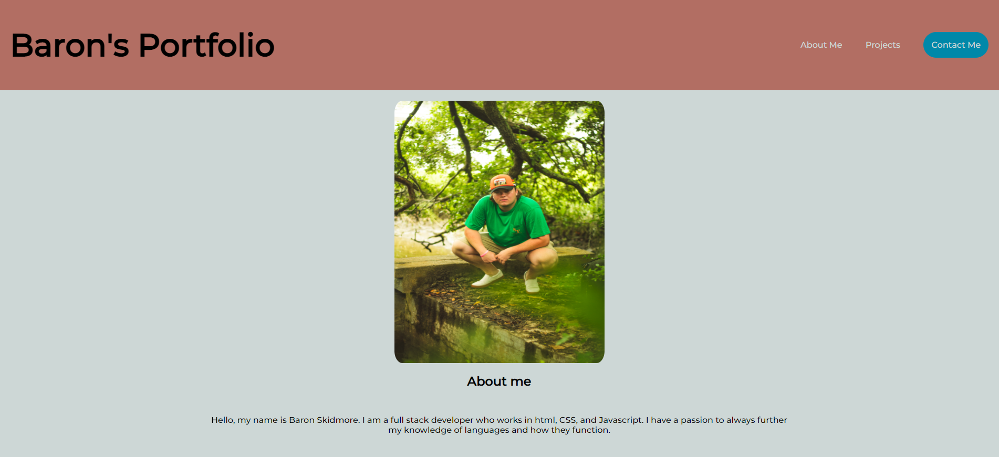
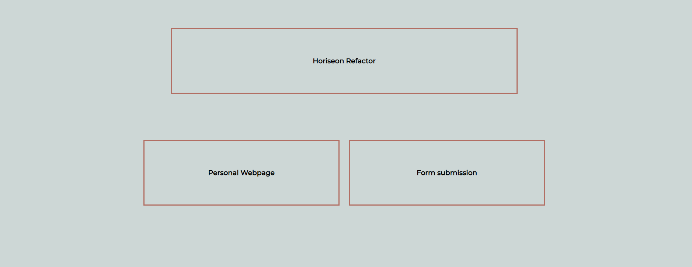

# Portfolio

## Table of Contents

1. [Portfolio](#portfolio-webpage-link)
2. [Description](#description)
3. [Visuals](#visuals)

## Portfolio Webpage Link

[Baron's Portfolio](https://iamskidd7.github.io/Portfolio-Homework/)

## Description

I have created a mock up portfolio to show the uses of the display properties and how someone might implement them into a webpage of their own.

## Visuals

